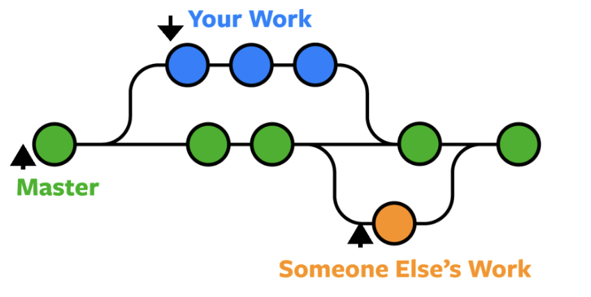
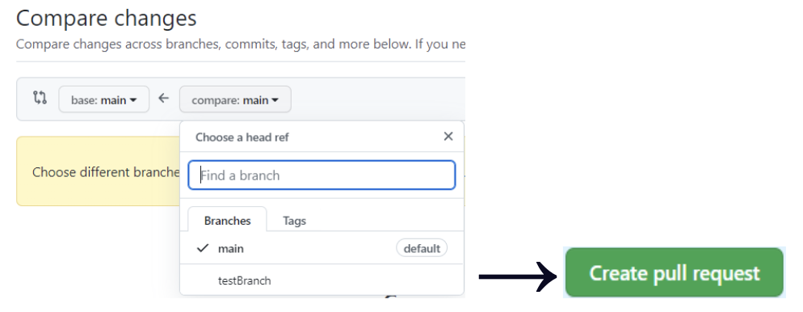
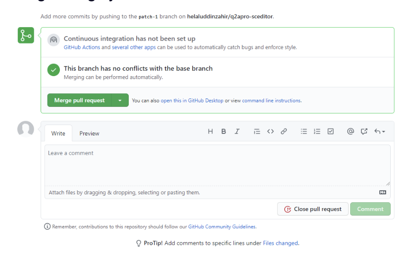

# Project Development Guide

A quick guide on how your team can contribute code to their project.

## 1. Pick an issue to fix/implement

Your project team is highly recommended to have an issue board/backlog ready to pull issues from. It is recommended to use the built-in Github issue board.

**Questions to ask yourself or with your team beforehand:**
- Will you need help with your issue?
- Is it truly a priority or part of the MVP? (minimum viable product)
- Are you able to take it on within reasonable time?
- Do you need to work with someone on this? What are the questions you have about this issue that need to be answered before you start coding?
- What research needs to be done to answer these questions or to solve this issue?

When it comes to actually brainstorming and coming up with issues and features as a team, take a look at `Part 7: Github Issue Brainstorm` of the `Project Guidelines & Timeline` section. The creation of good issues can streamline your project and help tremendously.

## 2. Create a branch with issue number

### What is a branch?
Branches allow you to develop features, fix bugs, or safely experiment with new ideas in a contained area of your repository. You always create a branch from an existing branch. Typically, you might create a new branch from the default branch of your repository. You can then work on this new branch in isolation from changes that other people are making to the repository.

A branch you create to build a feature is commonly referred to as a feature branch or topic branch. For more information, see "Creating and deleting branches within your repository."

### Creating a branch

Now that you have your issue ready in Github, you should create a new branch to implement it in. Remember to copy the issue number!

Here’s the [branch creation guide](https://docs.google.com/document/d/1_-BmYAlO3tywoB-NV7hDnuKfGTsDh2uXNf51r85Dxes/edit#heading=h.4b2inr8pljl8) in our Github guide

The branch name is recommended to follow the HCP style guide conventions.
Ex. git checkout -b 132-bug-login-timeout-error.

This details the issue number “132” and the type of issue it is (“bug”) along with a short but descriptive title for the bug “login-timeout-error”.

## 3. Write and commit your code

<u>IMPORTANT</u>: Be very careful to commit your code on your selected branch and not on the main branch

### What is a commit?
A commit is a snapshot in time of your selected git repository that records the state of your code. It provides you with a way to revert back to old commits if necessary and also compare the changes to your codebase between commits.

### How to do commits

See our Github guide [here](https://docs.google.com/document/d/1_-BmYAlO3tywoB-NV7hDnuKfGTsDh2uXNf51r85Dxes/edit#heading=h.23ipp7yllahh) to see how to commit, but here's the gist of it:

- Commit as often as possible to be able to track and revert your code well.
- Commits should be small and self-contained
  - Ex. If you fixed 2 bugs, each bug should be a different commit. Login is one, image fix is another.
  - Ex. If you tested and bug-fixed the login, that should be 1 commit
- A **commit message** is VITAL to making a commit understandable
  - The **commit message summary** is the title of the commit message. It should be short, descriptive, and in present tense.
  - The **commit message paragraph** is recommended for greater detail, it should explain the change, why the change was needed, and what side-effects it may cause

You MUST check that you are still on your branch “132…” by using “git branch” or “git status”. If you are accidentally on another branch then you may cause problems.

## 4. Create a branch with issue number

### What is a pull request
You are requesting the Github repository to merge the changes on your branch with the master/main branch.

### Creating a pull request

Once you have committed your code and are satisfied with the changes, you should create a **“pull request”** in Github.

You should choose the branch you want to merge with the main/master branch, and in the example below it is called “testBranch”. After you select your branch it shows a “compare changes” screen, only then will you be able to create the pull request. (Remember to leave a detailed comment!)

The pull request allows your team to review your code and give feedback to see if it is a welcome change.

[Here’s](https://docs.google.com/document/d/1_-BmYAlO3tywoB-NV7hDnuKfGTsDh2uXNf51r85Dxes/edit#heading=h.z5s474rtxu7l) some more technical information about pull requests from our Github guide and [here’s](https://docs.github.com/en/pull-requests/collaborating-with-pull-requests/proposing-changes-to-your-work-with-pull-requests/creating-a-pull-request) a guide on how to create a pull request from Github's documentation.

## 5. Get Feedback, Review, and Merge

### Why should you “review and approve” the merge/change?

The merge should be discussed with your team or else, as said before, issues may occur. Every programmer makes mistakes, no matter how great they are. As a result, you must depend on your team to catch those mistakes so that you ensure that you only ship high-quality code to your main branch. Just like the editor for a journalist edits their article before publishing, find someone on your team familiar with your work to edit and test your code before merging.

### Review process
The review process should be discussed briefly with your team or team members familiar with your work.  You should try to describe your changes and expand upon what will result from your changes.

Once you have that feedback, remember to review your code again as well as writing new tests if applicable. After you are done with the review process and no more changes are needed to your branch code, you can merge the ``changes to your Github main/master branch.

### Github pull request / Merging

In our HCP repositories, we configure it so that every pull request requires at least one reviewer to review and approve a pull request to the main branch. Only once you get the pull request approved, then you’ll be able to merge it in.

In “pull requests”, you should be able to click the “Merge pull request” button as seen below. Writing a short and detailed comment about the merge is highly recommended!

