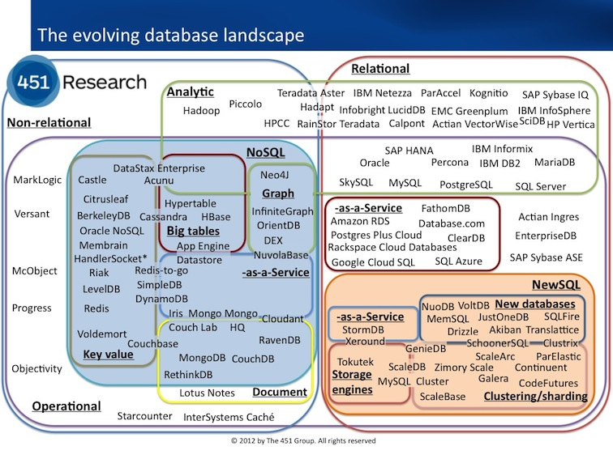

# Databases

This is a collection of resources for learning about databases.

## Introduction

A database is a collection of structured or unstructured data stored in a computer system so that it can be easily accessed, managed, and updated. Databases are used in various applications, from web development, analytics, warehousing, to machine learning, and are crucial in storing and retrieving data in web applications and multiple other digital solutions.

## Database Management Systems

A Database Management System (DBMS) is pivotal software that manages the database and its data. It handles data in an organized manner and helps users to run complex searches, update the database, and manage users and security. DBMS provides an interface to perform various operations like creating, deleting, updating, locking and many other functions that can be performed on a database.

*https://blogs.451research.com/information_management/tag/database/*

### Relational Databases

Relational databases, based on the relational model of data, store data in defined tables with rows and columns - often also referred to as a structured format. Each row of the table signifies a unique record, and each column corresponds to an attribute for that record. Common examples include mySQL, PostgreSQL, SQLite and more.

Relational databases are used in a wide variety of applications, from banking institutions, hospitals, universities, online shopping, to maintaining books in a library. They are primarily used for managing structured data and complex queries.

#### MySQL

MySQL, an open-source relational database management system (RDBMS), is based on SQL (Structured Query Language) and is a favorite among large corporations like Facebook, Google, and Twitter due to its reputation for speed, robustness, and ease of use. It is used widely for its compatibility with various platforms and the ability to handle large data sets.

#### PostgreSQL

PostgreSQL, another popular open-source relational database management system (RDBMS), is lauded for its ability to handle complex queries and its efficiency in managing relationships between tables. It is used by substantial corporations like Apple, Netflix, and Spotify due to its high performance and compatibility with various programming languages. Also, PostgreSQL is reportedly more compliant with SQL standards.

#### SQLite

SQLite, unlike other relational management systems, has a server-less design and is self-contained. One of the most considerable advantages of SQLite is its minimal setup and administration it requires. Consequently, it's perfect for embedded systems, mobile applications, and beginner developers, making it one of the most widely deployed databases in the world.

#### NewSQL

NewSQL databases represent a modern approach to SQL databases designed to maintain the well-appreciated features of SQL, including the ACID guarantees, while catching up with the scalability provided by NoSQL systems for Online Transaction Processing (OLTP) workloads. Some examples include TiDB, CockroachDB, and PlanetScale.

NewSQL databases are ideal for applications needing high performance and lower latency, like financial applications. They are also recommended for their compatibility with MySQL or PostgreSQL, although they may not offer all equivalent features.

### Non-Relational Databases

Non-relational databases, often called NoSQL databases, are more flexible with their data models. Instead of tables, they store data in various formats, like key-value pairs, documents, graphs, wide-column stores, or unique combinations of these. These types are drastically different from relational databases and are typically used for larger sets of distributed data.

#### MongoDB

MongoDB is an open-source non-relational database that is based on a document-oriented model, which can accommodate a variety of data types and structures. It stores data in a binary version of JSON documents. MongoDB shines when dealing with integration of the data from certain types of applications which is easier and faster, thanks to its ability to handle large and complex data with ease.

#### Redis

Redis is an in-memory, open-source, key-value data store. It is used heavily as a caching layer due to its speed and simplicity. Its support for different data structures, including but not limited to, strings, hashes, lists, and sets makes it unusual for a NoSQL database. Redis can also function as a message broker with pub/sub capabilities.

#### Firebase Realtime Database and Firestore

Firebase Realtime Database and Firestore are part of Google's Firebase suite of backend services. These provide a NoSQL cloud database to store and sync data between users in real-time. This makes it a compelling choice for developing real-time applications where you want to ensure that everyone sees the same data at the same time.

#### DynamoDB

DynamoDB is a NoSQL database service offered by Amazon that offers seamless, speedy performance. It's a key-value and document database that delivers single-digit millisecond performance at any scale and supports both document and key-value data models. Exceptional scalability, high availability, and durability are some of its highlights.

## Database Services

Database services are platforms which provide database functionality along with other features, such as user authentication, data analytics, real-time updates and more. Developers can leverage these services to streamline the development workflow and gain access to high-level resources.

#### Supabase (PostgreSQL)

Supabase is an open-source Firebase alternative, providing developers with features like authentication, authorization, real-time database and restful APIs and more. It is built atop PostgreSQL and boasts of its rapid integration and simplicity to use. It is intended to be an all-in-one backend service for your application.

#### Firebase (NoSQL)

Firebase, developed by Google, is a popular Backend-as-a-Service (BaaS) that allows developers to focus on what makes their applications unique. Its wide array of services, including hosting, real-time databases, authentication, analytics, and more, enable developers to quickly get their applications up and running.

#### CockroachDB (NewSQL)

CockroachDB follows the footsteps of Google Spanner in providing a globally-distributed transactional database. It is a cloud-native SQL database for building global, scalable cloud services that survive disasters.

#### TiDB (NewSQL)

TiDB is an open-source, MySQL-compatible, NewSQL database that supports Hybrid Transactional and Analytical Processing (HTAP) workloads. Accordingly, TiDB provides high performance and horizontal scalability.

#### PlanetScale (NewSQL)

PlanetScale is a robust, scalable database-as-a-service on Kubernetes. It provides a MySQL-compatible, transactionally consistent database that scales as required, making it a valuable tool for businesses looking to process large amounts of data without sacrificing reliability.

#### Neon (PostgreSQL)

Neon is a serverless, fully managed PostgreSQL service with modern developer-friendly features such as branching, bottomless storage, and on-demand auto-scaling. It optimizes developer productivity along with cost-effectiveness by only charging for its actual use.

## Database Selection Guidance

Summary: Neon (PostgreSQL) is the best free choice.

Choosing between RDBMS (Relational Database Management System), NoSQL, or NewSQL depends on the needs of your project. RDBMS is suggested for long-term projects due to its stability and powerful querying capabilities. However, for short-term projects or projects with specific data requirements, NoSQL could be the best choice due to its flexibility, scalability and speed.

When selecting between MySQL, PostgreSQL, SQLite, or NewSQL for your project, PostgreSQL with its balance of speed, extensibility, and standards compliance is highly recommended. PostgreSQL provides comprehensive and efficient support for JSON data type. It not only allows storing and retrieving JSON objects but also offers powerful query functions for querying, processing, and creating JSON data. By contrast, while MySQL does have JSON support, it's not as advanced or efficient as PostgreSQL's.

As your application grows in complexity and demand, you might find that traditional RDBMS systems or NoSQL databases can't keep up with the required speed and scalability. In such cases, transitioning to a NewSQL database like TiDB, CockroachDB, or PlanetScale might be advantageous. Designed to offer the scalability of NoSQL while retaining the ACID guarantees and simplicity of SQL, NewSQL databases cater to high-scale data processing needs.

Simultaneously, implementing caching mechanisms can provide substantial improvements in performance. For instance, using an in-memory data store like Redis to cache API results can significantly reduce the load on the database and speed up response times by storing frequently requested data in fast-access memory.

Lastly, when considering Database Services for your growing application, serverless solutions like Neon that offer on-demand scaling and cost-effectiveness become very attractive. Neon not only supports the scalability and availability your application may demand but also provides modern features like branching and bottomless storage, increasing its value proposition. Neon can be used for free.
